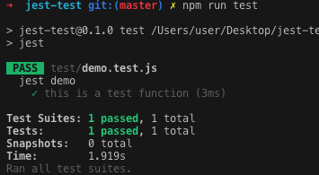
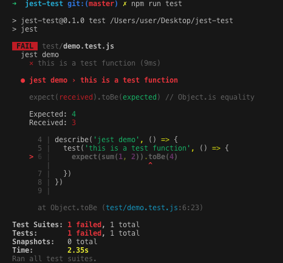
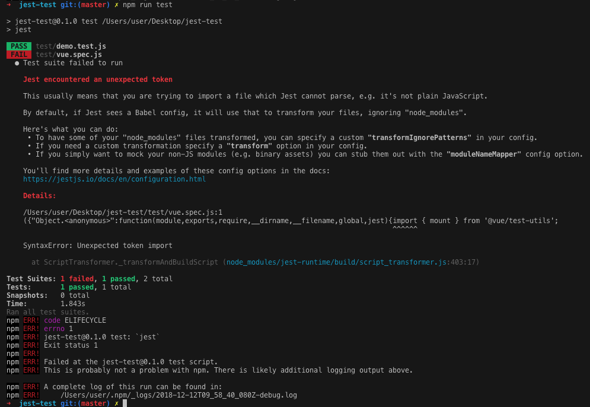
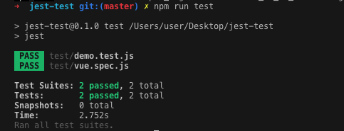
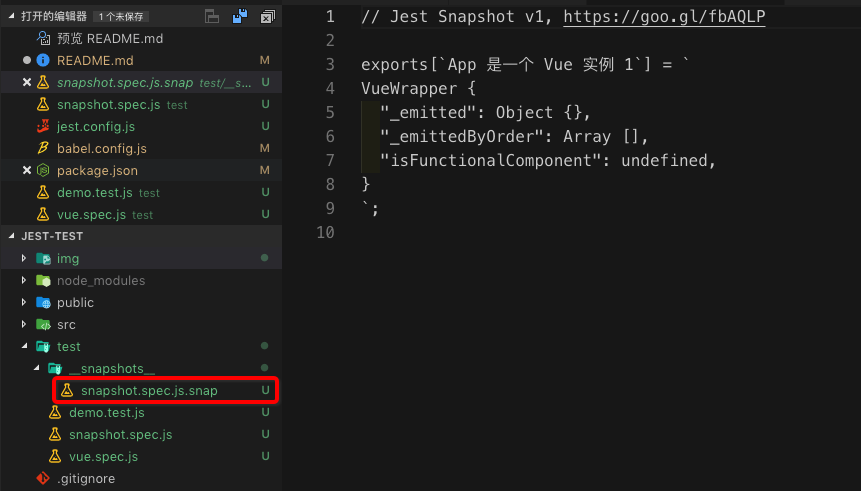
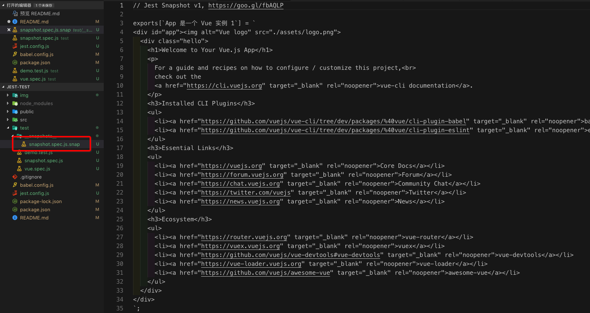
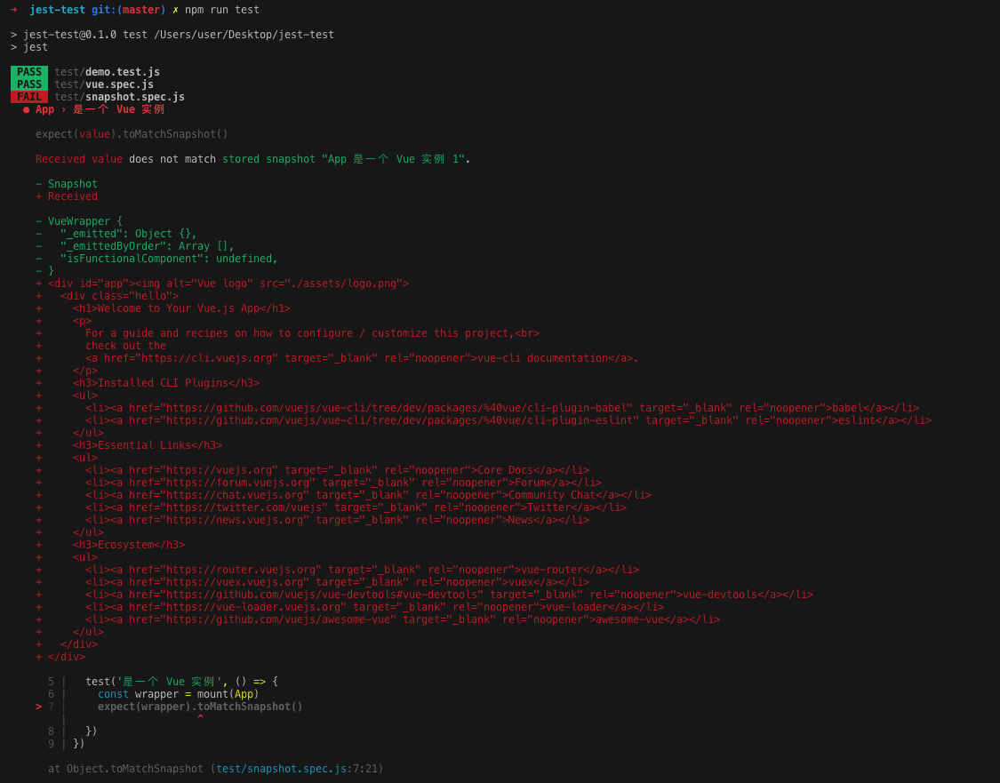

# jest

## 起步

### 如何使用 jest 测试一个函数

1. 安装 jest

```shell
npm i -D jest
```

2. 添加`package.json`

```json
{
  "scripts": {
    "test": "jest"
  }
}
```

3. 新建 tests/demo.spec.js

```js
describe('jest demo', () => {
  test('this is a test function', () => {
    expect(sum(1, 2)).toBe(3)
  })
})

function sum(a, b) {
  return a + b
}
```

jest 默认会查找项目中所有`.spec.js`和`.test.js`文件

4. 运行`npm run test`

成功截图


失败截图


### 如何使用 jest 测试 vue 项目

@vue/@vue/test-utils 是 Vue.js 官方的单元测试实用工具库 官网地址 [ https://vue-test-utils.vuejs.org/zh/ ]

1. 第一步,安装`@vue/@vue/test-utils`

```shell
npm i -D @vue/test-utils babel-jest vue-jest bable-core (需要7.0.0-0版本)
```

2. 根目录新建`jest.config.js`文件添加配置信息（或者在 package.json 中配置)

```js
// this is a config file of jest
module.exports = {
  moduleFileExtensions: ['js', 'json', 'vue'],
  moduleNameMapper: {
    '^@/(.*)$': '<rootDir>/src/$1' // 根据项目修改路径
  },
  transform: {
    '^.+\\.js$': '<rootDir>/node_modules/babel-jest', // 使用babel-jest解析js文件
    '.*\\.(vue)$': '<rootDir>/node_modules/vue-jest' // 使用vue-jest解析vue文件
  }
}
```

3. 新建一个`vue.spec.js`文件

```js
import { mount } from '@vue/test-utils'
import App from '../src/App.vue'

describe('App', () => {
  test('是一个 Vue 实例', () => {
    const wrapper = mount(App)
    expect(wrapper.isVueInstance()).toBeTruthy()
  })
})
```

4. 运行`npm run test`。此时会得到一个错误



错误解析: 此报错为`import`语法关键词无法识别，因为 jest 运行环境为 node，node 中使用的是`commonjs`，而`import`语法为 ES6 语法，所以无法识别。

解决办法: 在 babel 的配置文件中添加一项

```js
// this is a config file of babel
const { BABEL_MODULE, NODE_ENV } = process.env
const useESModules = BABEL_MODULE !== 'commonjs' && NODE_ENV !== 'test' // babel模块和test环境使用commonjs
module.exports = {
  presets: [
    // 预设置
    [
      '@babel/preset-env',
      {
        modules: useESModules ? false : 'commonjs'
      }
    ]
  ]
}
```

如果遇到了`import`报错问题，则需要添加一个插件`@babel/plugin-syntax-dynamic-import`，在执行单元测试时，预先解析 import，转译为`require`

```js
// this is a config file of babel
{
  plugins:[..., '@babel/plugin-syntax-dynamic-import', ...]
}
```

至此，一个 jest 单元测试就完成了！



### 测试快照

1. 新建一个`snapshot.spec.js`文件，并运行 npm run test

```js
import { mount } from '@vue/test-utils'
import App from '../src/App.vue'

describe('App', () => {
  test('是一个 Vue 实例', () => {
    const wrapper = mount(App)
    expect(wrapper).toMatchSnapshot()
  })
})
```



这里的测试快照是，使用`jest-serializer-vue`美观插件来美化测试快照

jest 会在快照测试文件的附近生成一个`__snapshots__`文件夹存储对应的快照文件`snapshot.spec.js.snap`。



如果后期被测试的文件被修改。则在测试时会报告发生错误的快照部分。当你确认是自己需要更新的部分，则可以使用`npm test -- -u`命令来覆盖上次保存的快照



---

问题汇总：

1. `import` 报错

```js
module.exports = function(api) {
  const { BABEL_MODULE, NODE_ENV } = process.env
  const useESModules = BABEL_MODULE !== 'commonjs' && NODE_ENV !== 'test'

  api && api.cache(false)

  return {
    presets: [
      [
        '@babel/preset-env',
        {
          loose: true,
          modules: useESModules ? false : 'commonjs'
        }
      ]
    ],
    plugins: [
      [
        '@babel/plugin-transform-runtime',
        {
          corejs: false,
          helpers: true,
          regenerator: false,
          useESModules
        }
      ],
      '@babel/plugin-syntax-dynamic-import', // 解决动态import无法转译问题
      '@babel/plugin-transform-object-assign'
    ]
  }
}
```

2. vue 文件 `export default` 报错 ---> `@babel/polyfill`

```js
// jest.config.js
module.exports = {
  setupFiles: ['<rootDir>/tests/jest.init.js'], // 配置或设置测试环境的模块的路径, 每个测试文件将运行一次setupFile
  moduleFileExtensions: ['js', 'json', 'vue'], // 文件扩展名数组
  moduleNameMapper: {
    // 模块名称的映射，允许存根资源，例如具有单个模块的图像或样式
    '^packages/(.*)$': '<rootDir>/packages/$1'
  },
  snapshotSerializers: ['<rootDir>/node_modules/jest-serializer-vue'], // 快照美观插件
  transform: {
    // 转换器路径的映射，为转换源文件提供同步功能的模块
    '^.+\\.js$': '<rootDir>/tests/jest.transform.js',
    // '^.+\\.js$': '<rootDir>/node_modules/babel-jest', // js 处理文件
    '.*\\.(vue)$': '<rootDir>/node_modules/vue-jest'
  },
  collectCoverage: true,
  coverageReporters: ['html', 'lcov', 'text-summary'],
  coverageDirectory: './tests/coverage'
}
```

3. `babel-core` 报错，需要 7.0.0-0 版本
